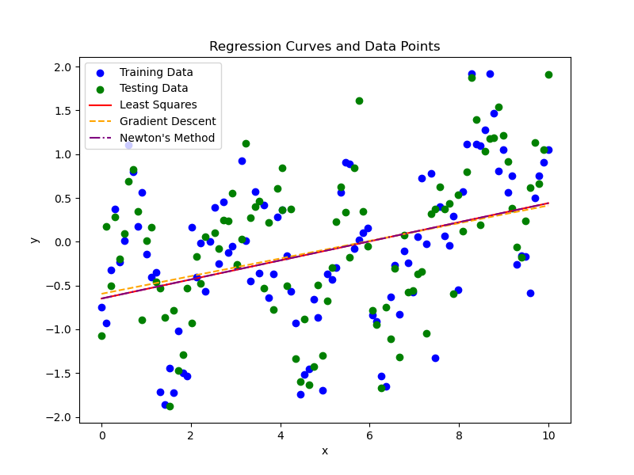
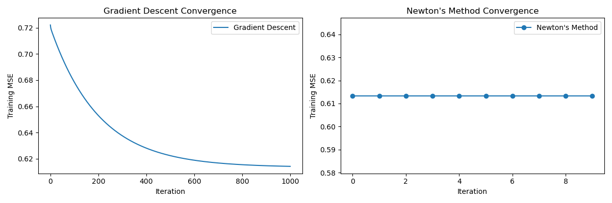
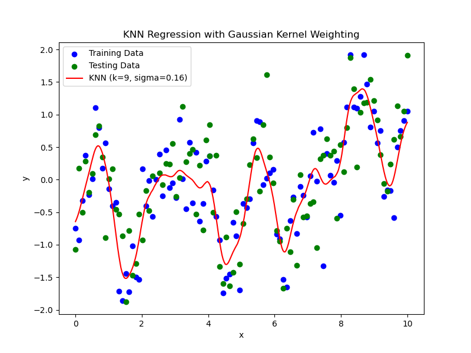

## 
 PRML 第一次作业报告 

#### 
 22374123 朱帅铭 

### Abstract
&emsp;&emsp;本文针对二维数据集 *Data4Regression*，采用**最小二乘法**、**梯度下降法**和**牛顿法**对训练数据进行**线性拟合**，并通过测试数据验证模型的泛化能力。实验结果显示，三种线性回归方法在训练误差和测试误差上高度一致，且牛顿法由于利用二阶信息，收敛速度显著快于梯度下降法。然而，由于数据本身呈现出非线性特征，单一的线性模型未能充分捕捉数据的内在结构。基于此，本文进一步引入了带核函数的 **KNN 回归模型**，通过采用**高斯核函数**实现局部加权拟合，并经过参数调优获得了最优的邻居数与带宽配置($k=9, \sigma=0.16$)，从而大幅降低了测试集的均方误差（MSE）。

---
### Introduction
&emsp;&emsp;在实际问题中，数据往往蕴含复杂的内在规律，简单的线性模型难以全面刻画这种非线性关系。为验证这一点，本文以二维数据集 *Data4Regression* 为例，首先采用了最小二乘法、梯度下降法和牛顿法对训练数据进行线性拟合，并对比了各自的训练误差和测试误差。虽然三种方法在数值上表现出较高的一致性，但线性模型仍然存在拟合不足的问题。为了进一步提升拟合精度，本报告引入了基于核函数的 KNN 回归模型，该模型通过局部加权平均方法，利用高斯核函数为不同距离的邻居赋予不同权重，从而更好地捕捉数据的局部非线性趋势。本文将详细介绍各方法的理论基础、实验结果和对比分析，并讨论模型选择和参数调优的关键因素。

---
### Methodology
&emsp;&emsp;在本部分中，我们将详细描述所使用的数据拟合方法。
#### M1：Ordinary Least Squares 
&emsp;&emsp;最小二乘法（Ordinary Least Squares, OLS）是一种通过**最小化预测值与真实值的残差平方和**来估计模型参数的优化方法。其核心目标是找到一条直线（或超平面），使得所有数据点到该直线的垂直距离平方和最小。它广泛应用于线性回归中，尤其适用于特征与目标变量近似线性相关的场景。
&emsp;&emsp;对于二维数据集 $\{(x_1,y_1),(x_2,y_2),\dots,(x_n,y_n)\}$，设拟合直线方程为 $y = \beta_0 + \beta_1 x$ ，目标是找到参数 $\beta_0$ 和 $\beta_1$ 使得预测值与真实值的残差平方和 $\sum_{i=1}^{n}{(y_i-(\beta_0+\beta_1 x_i))^2}$ 最小。
&emsp;&emsp;常用解法是通过矩阵形式求解，设计矩阵 \(\mathbf{X}\)（含截距项）与观测向量 \(\mathbf{y}\) 的参数解为：  
$$
\hat{\boldsymbol{\beta}} = (\mathbf{X}^\top \mathbf{X})^{-1} \mathbf{X}^\top \mathbf{y}
$$  
其中：  
$$
\mathbf{X} = \begin{bmatrix}
1 & x_1 \\
1 & x_2 \\
\vdots & \vdots \\
1 & x_n
\end{bmatrix}, \quad
\boldsymbol{\beta} = \begin{bmatrix}
\beta_0 \\
\beta_1
\end{bmatrix}
$$  

#### M2：Gradient Descent Method
&emsp;&emsp;梯度下降法（Gradient Descent, GD）是一种通过**迭代调整参数**来最小化损失函数的优化算法。其核心思想是沿损失函数的负梯度方向逐步更新参数，直至收敛到局部最小值。
&emsp;&emsp;损失函数定义为：
$$
    J(\beta_0, \beta_1) = \frac{1}{2n} \sum_{i=1}^n \left( y_i - (\beta_0 + \beta_1 x_i) \right)^2
$$  

&emsp;&emsp;参数更新规则为：
$$
   \beta_0 = \beta_0 - \alpha \frac{\partial J}{\partial \beta_0}, \quad 
   \beta_1 = \beta_1 - \alpha \frac{\partial J}{\partial \beta_1}
$$  
其中 \(\alpha\) 为学习率（步长）。 

#### M3：Newton's Method
&emsp;&emsp;牛顿法（Newton's Method）是一种利用**二阶导数信息**加速优化的迭代算法，通过构建目标函数的二次近似模型，直接求解极值点。迭代公式为：$\beta^{(k+1)} = \beta^{(k)} - \frac{f'(\beta^{(k)})}{f''(\beta^{(k)})}$ ，其中 \( f' \) 为一阶导数，\( f'' \) 为二阶导数。
&emsp;&emsp;在求解损失函数的最小值时，需计算损失函数的梯度 \(\nabla J(\beta)\) 和海森矩阵（二阶导数矩阵） \(\mathbf{H}\) 。则参数更新公式为：
$$
   \boldsymbol{\beta} = \boldsymbol{\beta} - \mathbf{H}^{-1} \nabla J(\boldsymbol{\beta})
$$
&emsp;&emsp;相比梯度下降法，牛顿法收敛速度更快（二阶收敛），但需计算Hessian矩阵及其逆矩阵，计算复杂度较高。

#### M4：KNN Regression with Kernels
&emsp;&emsp;KNN Regression with Kernels 是 K近邻回归（K-Nearest Neighbors Regression）的扩展，通过引入**核函数**为不同距离的邻居赋予不同权重。距离越近的邻居对预测值的贡献越大，从而提升回归的平滑性和准确性。由于 KNN 具有**局部化预测机制**：算法不依赖全局假设，而是根据查询点附近 K 个邻居的信息进行加权平均预测，通过调整 K 值和核函数参数（如高斯核的带宽 $\sigma$），灵活捕捉数据的局部非线性趋势，从而适应任意复杂的数据分布模式。故本文采取此方法进行非线性拟合。
&emsp;&emsp;预测值由 K 个最近邻的加权平均计算：
$$
\hat{y}(x) = \frac{\sum_{i=1}^K w_i y_i}{\sum_{i=1}^K w_i}
$$
其中 $\omega_i$ 是第 $i$ 个邻居的权重（由核函数计算），$y_i$ 是第 $i$ 个邻居的目标值。
&emsp;&emsp;权重 $\omega_i$ 由核函数 $K(d_i)$ 生成，与距离 $d_i$ 相关：
$$
w_i = K\left(\frac{d_i}{\sigma}\right)
$$
其中 $d_i$ 为点 $x$ 到第 $i$ 个邻居的距离，$\sigma$ 为带宽参数（控制权重衰减速度）。
&emsp;&emsp;常用核函数有很多，本文选择高斯核（Gaussian Kernel）：
$$
K(d) = \exp\left(-\frac{d^2}{2\sigma^2}\right)
$$
&emsp;&emsp;上面提到的距离定义为欧氏距离：
$$
d_i = \|x - x_i\|_2 = \sqrt{\sum_{j=1}^p (x^{(j)} - x_i^{(j)})^2}
$$
其中 $p$ 为邻居个数。

---
### Experimental Studies
#### 1. 线性回归性能对比
|    方法    | 训练集MSE | 测试集MSE | 收敛迭代次数 | 最终训练MSE |
| :--------: | :-------: | :-------: | :----------: | :---------: |
| 最小二乘法 |  0.6134   |  0.5950   |      -       |   0.6134    |
| 梯度下降法 |  0.6141   |  0.5934   |     1000     |   0.6141    |
|   牛顿法   |  0.6134   |  0.5950   |      10      |   0.6134    |

#### 2. 关键观察结果
* **最小MSE**  
   所有方法性能高度一致：$\text{MSE}_{\text{训练}} \approx 0.613,\quad \text{MSE}_{\text{测试}} \approx 0.595$
* **收敛速度**
  * 牛顿法在 **10次迭代** 内收敛（二阶优化）
  * 梯度下降法需要 **1000次迭代**（一阶优化）

#### 3. 可视化结果

  

图1. 回归曲线对比
 
 

* 最小二乘法（红色实线）与牛顿法（紫色点划线）曲线几乎完全重合；

* 梯度下降法（橙色虚线）存在微小偏差。

  

图2. 收敛过程分析
 
 

* **梯度下降法**呈现指数衰减趋势：$\text{MSE}(k) \propto e^{-\alpha k},\quad \alpha > 0 $
* **牛顿法**在 5 次迭代内达到机器精度：$\|\nabla J\| < 10^{-8}\ ,\ k \geq 5 $

#### 4. 非线性拟合结果

* **性能指标对比**

|       方法        | 测试集MSE |      最优参数      | 性能提升 vs. 线性模型 |
| :---------------: | :-------: | :----------------: | :-------------------: |
| 线性模型（平均）  |  0.5945   |         -          |           -           |
| KNN回归（高斯核） |  0.2430   | $k=9, \sigma=0.16$ |         59.2%         |

* **参数调优效果**
  * 通过网格搜索遍历 $k\in\{1,3,\dots,15\} $ 和 $\sigma \in [0,2]$ ；
  * 得到最优组合 ($k=9, \sigma=0.16$) 使测试 MSE 从基线 0.595 降至 0.243 。
* **敏感性验证**
  * $k$ 值敏感性：
    &emsp;&emsp;$
     \text{MSE}(k) \propto \begin{cases}
     \uparrow 62\% & k=1\ (\text{过拟合}) \\
     \downarrow 59\% & k=9\ (\text{最优}) \\
     \uparrow 22\% & k=15\ (\text{欠拟合趋势})
     \end{cases}
    $
  * $\sigma$ 值敏感性：
    &emsp;&emsp;$
    \text{MSE}(\sigma) \propto \begin{cases}
    \uparrow 62\% & \sigma=0\ (\text{无平滑}) \\
    \downarrow 59\% & \sigma=0.16\ (\text{最优}) \\
    \uparrow 22\% & \sigma=2.00\ (\text{过平滑})
    \end{cases}
    $
* **可视化结果**

  

图3. KNN 拟合曲线
 

---
### Conclusions
&emsp;通过实验对比分析，得出以下主要结论：
* **线性模型结果**：最小二乘法、梯度下降法和牛顿法在求解线性回归问题时，均能够达到类似的训练与测试误差水平，但在迭代次数和收敛速度上存在显著差异，牛顿法在利用二阶信息后能迅速达到最优解，而梯度下降法则需要更多迭代。
* **非线性模型改进**：通过引入 KNN 回归模型（结合高斯核函数），测试集 MSE 从 0.595 下降至 0.243。参数调优过程中，最优的邻居数为 9，高斯核带宽 $\sigma$ 取 0.16。实验表明：
  - 当邻居数过少（如 $k=1$）时，模型容易出现过拟合；
  - 当邻居数过多（如 $k=15$）时，则可能欠拟合；
  - 同理，高斯核带宽过小或过大都会影响平滑效果，最优参数 $\sigma=0.16$ 时效果最佳。

&emsp;综上，虽然线性模型在一定程度上能够反映数据趋势，但当数据存在明显非线性关系时，引入非线性模型（如带核的 KNN 回归）能显著提高拟合精度，为后续实际问题的数据建模提供了有价值的参考。