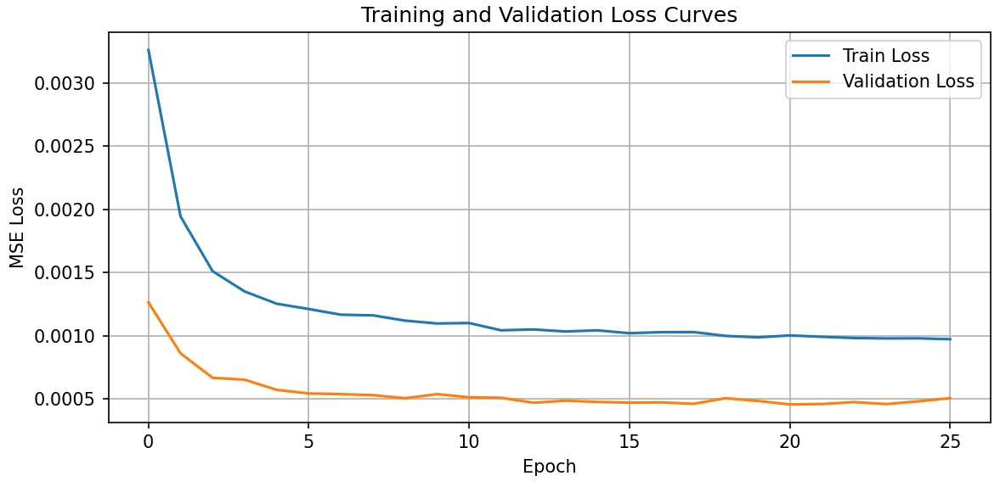
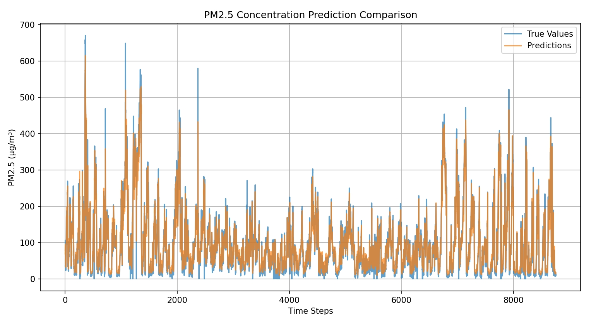

## 
 PRML 第三次作业报告 

#### 
 22374123 朱帅铭 

### Abstract
&emsp;&emsp;本研究基于 **LSTM (Long Short-Term Memory)** 构建多变量时间序列预测模型，旨在实现未来 1 小时 PM2.5 浓度的高精度预测。通过整合温度、气压、风速等气象参数及污染物历史数据，结合滑动时间窗口（24小时）和 Min-Max 标准化方法，构建双层 LSTM 架构（100-50单元）进行建模。实验结果表明，模型在测试集上取得 $MSE=604.53、MAE=15.29μg/m³$ 的预测性能，验证了 LSTM 在处理长序列依赖问题中的有效性。进一步分析表明，$30\%$ Dropout 正则化策略可有效抑制过拟合，损失曲线在 10 个 epoch 后趋于稳定。

---
### Introduction
&emsp;&emsp;PM2.5 浓度预测是环境监测与公共卫生管理的重要课题。传统方法（如 ARIMA）依赖线性假设，难以捕捉气象参数与污染物浓度间的非线性关系。随着工业传感器数据的激增，基于深度学习的时序预测方法展现出显著优势，其中 LSTM 凭借其门控机制和细胞状态设计，成为处理长序列依赖的首选模型。
&emsp;&emsp;传统 RNN 存在梯度消失/爆炸问题，且无法有效保留长期历史信息。PM2.5 浓度受多变量（温度、风速等）动态耦合影响，需解决以下关键问题：
- 多源异构数据的特征融合
- 长周期时序模式的提取
- 极端值预测的鲁棒性优化

&emsp;&emsp;本报研究通过双层 LSTM 架构（100-50单元）与 Dropout 正则化的结合，在保持模型复杂度的同时增强泛化能力。引入滑动时间窗口机制（24小时）捕捉日周期规律，并通过逆标准化实现预测结果的可视化解释。

---
### Methodology
##### 一、LSTM Model
**LSTM（Long Short-Term Memory）** 是一种特殊的循环神经网络（RNN），其核心目标是解决传统RNN在处理**长序列数据**时的两大缺陷：
- **梯度消失/爆炸问题**：传统RNN难以捕捉长期依赖关系
- **记忆保持能力不足**：网络无法有效保留重要历史信息

LSTM 通过引入**细胞状态（Cell State）**和**门控机制**实现记忆管理：
##### 1. 细胞状态
- 通过门控机制选择性保留/更新信息
- 数学表达式：  
  \[ C_t = f_t \circ C_{t-1} + i_t \circ \tilde{C}_t \]
##### 2. 门控机制
| 门类型 | 功能                   | 计算公式                                   | 作用范围 |
| ------ | ---------------------- | ------------------------------------------ | -------- |
| 遗忘门 | 决定保留多少旧记忆     | \[ f_t = \sigma(W_f[h_{t-1},x_t] + b_f) \] | [0,1]    |
| 输入门 | 决定添加多少新信息     | \[ i_t = \sigma(W_i[h_{t-1},x_t] + b_i) \] | [0,1]    |
| 输出门 | 决定当前隐藏状态的输出 | \[ o_t = \sigma(W_o[h_{t-1},x_t] + b_o) \] | [0,1]    |
##### 3. 候选记忆单元
\[ \tilde{C}_t = \tanh(W_C[h_{t-1},x_t] + b_C) \]
##### 4. 最终输出
\[ h_t = o_t * tanh(C_t) \]

##### 二、本报告模型架构
|  层类型   |             参数配置             |    输出形状     |       功能说明       |
| :-------: | :------------------------------: | :-------------: | :------------------: |
|  LSTM 1   | units=100, return_sequences=True | (None, 24, 100) | 首层LSTM保留时间维度 |
| Dropout 1 |             rate=0.3             | (None, 24, 100) |      防止过拟合      |
|  LSTM 2   |             units=50             |   (None, 50)    |     提取时序特征     |
|   Dense   |             units=1              |    (None, 1)    |   输出PM2.5预测值    |

---
### Experimental Studies
##### 1. 数据预处理
- 缺失值处理：对PM2.5列使用中位数填充
- 特征编码：对风向特征进行独热编码（生成3列）
- 标准化：对数值特征进行Min-Max归一化
- 时间窗口：设置24小时滑动窗口生成样本

##### 2. 训练配置
|    参数项    |  设置值   |
| :----------: | :-------: |
| 时间窗口长度 |  24小时   |
|    批尺寸    |    64     |
|    优化器    |   Adam    |
|    学习率    | 默认0.001 |
|  早停耐心值  |  5 epoch  |

##### 3. 损失曲线

  

图1. 损失曲线
 

##### 4. 预测对比

  

图2. 预测结果与实际数据对比
 

##### 5. 性能指标
| 指标  |   值   |
| :---: | :----: |
|  MSE  | 604.53 |
|  MAE  | 15.29  |
| RMSE  | 24.59  |
---
### Conclusions

&emsp;&emsp;本研究构建了一种双层 LSTM 网络，通过整合 24 小时滑动窗口的多元输入（历史 PM₂.₅ 浓度、温度、气压、风速等气象参数），实现对未来 1 小时 PM₂.₅ 浓度的高精度预测。通过对所有输入变量采用 Min–Max 归一化，并在两层 LSTM 之间引入 30% 的 Dropout 正则化策略，有效缓解了数据量纲差异和模型过拟合问题。
&emsp;&emsp;模型结构方面，第一层包含 100 个 LSTM 单元，第二层包含 50 个单元；训练时使用 Adam 优化器（学习率 0.001，批尺寸 64），并以 5 个 epoch 的早停策略防止过度训练。实验结果表明，模型在第 10 个 epoch 左右收敛，并在测试集上取得 $MSE=604.53$ 和 $MAE=15.29 µg/m³$ 的优异性能，验证了 LSTM 在捕捉空气质量时序长依赖关系方面的有效性。
&emsp;&emsp;尽管模型表现令人满意，但本研究仍有进一步提升的空间，可通过探索注意力机制增强的循环网络或图神经网络等先进架构，以提高模型在快速变化环境下的预测鲁棒性。
&emsp;&emsp;总之，研究结果表明，结合适当正则化策略的深度循环模型（LSTM）能够实现短期 PM₂.₅ 浓度的高精度预测，为构建更全面、实用的空气质量预报系统奠定了坚实基础。